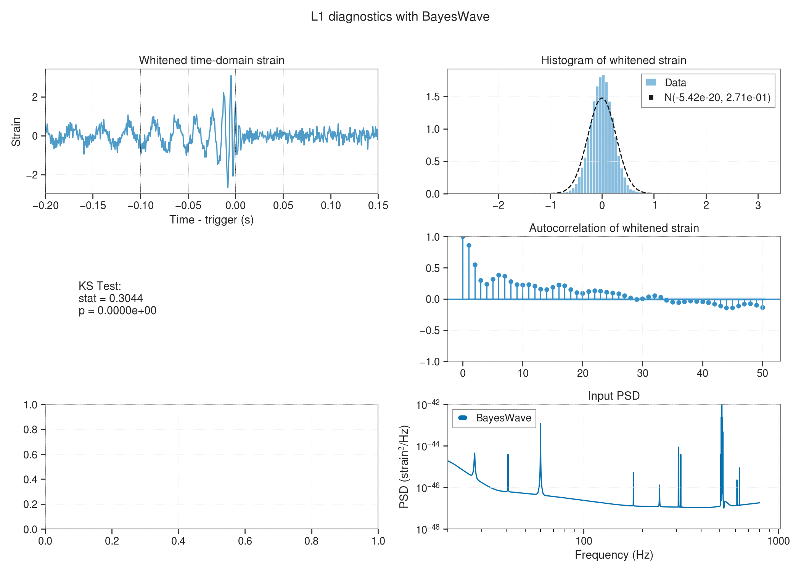

# Ongoing runs
---
| Run Type | Location | Summary Pages|
|---       |---       |---           |
| GR Non-eccentric Aligned | UWM: `/home/koustav.chandra/projects/o4/s250114ax/teobresums/teobresums-non-eccentric-aligned/` |
| GR Non-eccentric Precessing | `/home/koustav.chandra/projects/o4/s250114ax/teobresums/teobresums-non-eccentric-precessing`| 


# Submitting runs
---
Do what Ross wrote in the README.md. Namely:
```
conda activate /home/rossella.gamba/.conda/envs/lalsuite-param-teob/
source /home/rossella.gamba/src/lalsuite-param-teob/_inst/etc/lalsuiterc
export PYTHONPATH=$PYTHONPATH:/home/rossella.gamba/src/lalsuite-param-teob/lalsimulation/python/lalsimulation
```

# PSD Checks

BayesWave vs Welch




